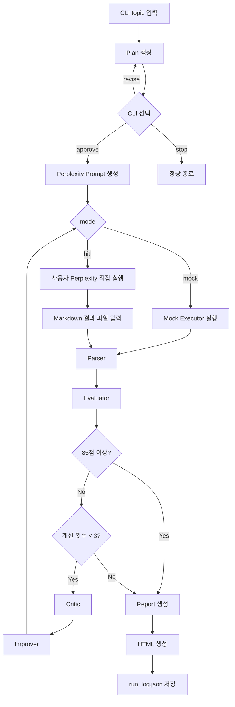

# 03. Architecture

## 기본 방향

구조는 단순하게 유지한다. 핵심은 LangGraph 흐름과 Executor를 분리하는 것이다.

```text
CLI
→ LangGraph Workflow
→ Nodes
→ Mock Executor 또는 HITL Result Import
→ Artifacts
```

## 문서 역할

이 문서는 PRD 요구사항을 실제 코드 구조로 연결한다. 구현 중 구조를 바꿔야 한다면 먼저 이 문서의 컴포넌트 책임과 추적표를 수정한다.

## 권장 폴더 구조

```text
app/
  cli.py
  graph.py
  state.py
  executors/
    base.py
    mock_executor.py
    manual_executor.py
  nodes/
    intake.py
    planner.py
    prompt_builder.py
    executor.py
    hitl_result_loader.py
    parser.py
    evaluator.py
    critic.py
    improver.py
    result_builder.py
    html_publisher.py
  prompts/
    planner.md
    perplexity_research.md
    evaluator.md
    critic.md
    improver.md
tests/
  test_graph_flow.py
  test_plan_gate.py
  test_executor_mock.py
  test_parser.py
  test_evaluator.py
  test_improvement_loop.py
  test_report_builder.py
```

## Workflow 흐름



## ResearchState 필드

```text
topic
purpose
depth
report_type
executor_mode
result_file
research_plan
plan_status
research_prompt
raw_results
parsed_result
evaluation_score
evaluation_report
critic_notes
improvement_prompt
improvement_count
quick_summary_report
html_report
output_dir
errors
```

## 상태 필드 책임

| 필드 | 생성/수정 주체 | 검증 포인트 |
| --- | --- | --- |
| `topic` | CLI/intake | 빈 값이면 실행하지 않는다. |
| `executor_mode` | CLI | `mock`, `hitl` 중 하나여야 한다. |
| `result_file` | CLI/HITL | hitl 모드에서 사용자가 가져온 Markdown 파일 경로다. |
| `research_plan` | planner | 승인 전 사용자에게 출력된다. |
| `plan_status` | CLI Plan Gate | `approve`, `revise`, `stop` 중 하나여야 한다. |
| `research_prompt` | prompt_builder | Mock 입력 또는 사용자가 Perplexity에 직접 넣을 프롬프트로 사용된다. |
| `raw_results` | mock executor 또는 hitl_result_loader | 승인 후에만 값이 생긴다. |
| `parsed_result` | parser | 보고서 생성의 입력이 된다. |
| `evaluation_score` | evaluator | 0~100 범위여야 한다. |
| `improvement_count` | critic/improver loop | 3을 초과하면 안 된다. |
| `quick_summary_report` | result_builder | Markdown 보고서 내용이다. |
| `html_report` | html_publisher | HTML 보고서 내용이다. |
| `errors` | 모든 노드 | 실패 노드와 이유를 남긴다. |

## Executor 인터페이스

```python
class ResearchExecutor(Protocol):
    def run(self, prompt: str, state: ResearchState) -> str:
        ...
```

## Executor 선택 정책

| mode | 동작 |
| --- | --- |
| mock | `MockResearchExecutor` 사용 |
| hitl | `ManualResearchExecutor` 또는 `hitl_result_loader`로 사용자 제공 Markdown 파일 읽기 |

기본값은 `mock`이다.

## 컴포넌트 책임

| 컴포넌트 | 책임 | 관련 요구사항 |
| --- | --- | --- |
| `app/cli.py` | topic/mode 입력, Plan Gate 처리 | FR-01, FR-02, FR-04, FR-06, FR-07 |
| `app/graph.py` | LangGraph 노드 연결과 분기 | FR-05, FR-11, FR-12 |
| `app/state.py` | Workflow 상태 정의 | 전체 |
| `app/executors/base.py` | Executor Protocol 정의 | FR-16 |
| `app/executors/mock_executor.py` | API 없는 테스트용 결과 반환 | FR-08 |
| `app/executors/manual_executor.py` | 사용자 제공 Markdown 결과 파일 읽기 | FR-17 |
| `app/nodes/planner.py` | 리서치 계획 생성 | FR-04, FR-06 |
| `app/nodes/prompt_builder.py` | Perplexity에 직접 넣을 프롬프트 생성 | FR-16 |
| `app/nodes/executor.py` | mock 모드 결과 생성 | FR-05, FR-08 |
| `app/nodes/hitl_result_loader.py` | hitl 모드 결과 파일 읽기 | FR-17 |
| `app/nodes/parser.py` | Markdown 결과 구조화 | FR-09 |
| `app/nodes/evaluator.py` | 100점 기준 평가 | FR-10 |
| `app/nodes/critic.py` | 낮은 점수 원인 분석 | FR-11 |
| `app/nodes/improver.py` | 개선 프롬프트 생성 | FR-11, FR-12 |
| `app/nodes/result_builder.py` | Markdown 보고서 생성 | FR-13 |
| `app/nodes/html_publisher.py` | HTML 보고서 생성 | FR-14 |

## 산출물 저장 정책

모든 산출물은 `output_dir`에 저장한다. MVP에서는 기본값을 프로젝트 폴더로 둔다.

```text
research_plan.yaml
approved_plan.yaml
research_prompt.md
raw_result_01.md
parsed_result.json
evaluation_report.yaml
critic_notes.md
quick_summary_report.md
report.html
run_log.json
```

## 산출물 추적표

| 산출물 | 생성 주체 | 검증 테스트 |
| --- | --- | --- |
| `research_plan.yaml` | planner | `test_plan_gate.py` |
| `approved_plan.yaml` | Plan Gate | `test_plan_gate.py` |
| `research_prompt.md` | prompt_builder | `test_graph_flow.py` |
| `raw_result_01.md` | mock executor 또는 사용자 | `test_executor_mock.py`, `test_graph_flow.py` |
| `parsed_result.json` | parser | `test_parser.py` |
| `evaluation_report.yaml` | evaluator | `test_evaluator.py` |
| `critic_notes.md` | critic | `test_improvement_loop.py` |
| `quick_summary_report.md` | result_builder | `test_report_builder.py` |
| `report.html` | html_publisher | `test_report_builder.py` |
| `run_log.json` | graph/log writer | `test_graph_flow.py` |

## 에러 처리 정책

- 에러는 `ResearchState.errors`에 누적한다.
- 어떤 노드에서 실패했는지 `run_log.json`에 남긴다.
- API Key는 기본 Workflow에서 사용하지 않는다.

## 아키텍처 결정

| 결정 | 이유 | 영향 |
| --- | --- | --- |
| Executor Protocol 고정 | mock 결과와 수동 입력 결과를 같은 raw 결과로 다루기 위해 | Parser 이후 Graph 재사용 가능 |
| Plan Gate를 Prompt 생성 앞에 둠 | 승인 전 리서치 프롬프트 생성을 막기 위해 | 불필요한 수동 작업 방지 |
| 결과 저장을 파일 기반으로 시작 | MVP를 단순하게 유지하기 위해 | DB는 추후 검토 |
| 개선 루프 최대 3회 | 무한 반복 방지 | 테스트로 쉽게 검증 가능 |
| Perplexity API 직접 호출 제외 | 비용과 인증 부담을 줄이고 사용자가 직접 품질을 확인하기 위해 | API Key 없이 MVP 가능 |

## 문서 자체 평가

| 기준 | 점수 | 근거 |
| --- | --- | --- |
| 완정성 | 4.7 | 구조, 상태, 컴포넌트, 산출물, 에러 정책을 포함한다. |
| 명확성 | 4.6 | 각 컴포넌트 책임을 표로 분리했다. |
| 추적성 | 4.8 | 컴포넌트와 산출물을 PRD 요구사항 및 테스트에 연결했다. |
| 검증가능성 | 4.7 | 산출물별 검증 테스트가 명시되어 있다. |
| 유지보수성 | 4.7 | 아키텍처 결정과 영향 범위를 기록했다. |
